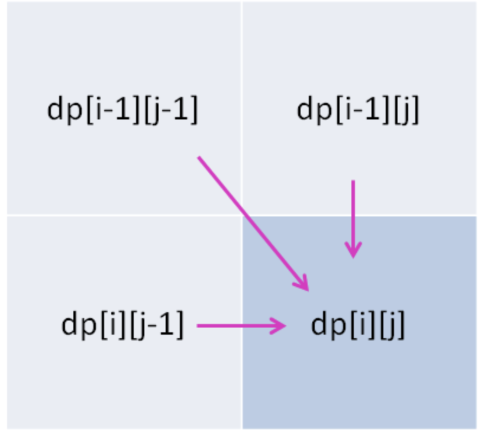
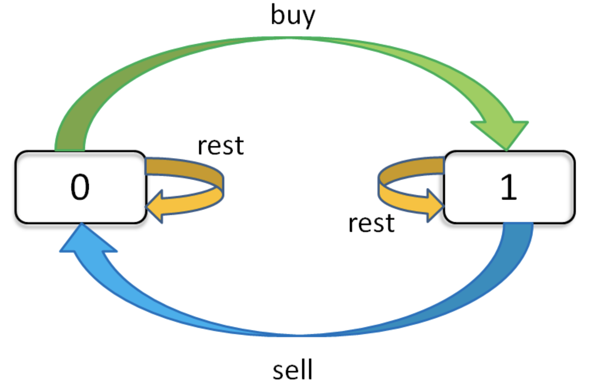

# 计算机网络体系结构
* 计算机网络的各层及其协议的集合；
* 分层的好处：易于研究和处理、各层独立、灵活性高、结构上可分割、易于实现和维护、能促进标准化工作；   
   

# 计算机网络
* 是一些互相连接的、自治的计算机集合；
* 按照网络交换功能分为[电路交换](#电路交换)、报文交换、[分组交换](#分组交换)、混合交换网；
* 按照作用范围分为广域网WAN、局域网LAN、城域网MAN、接入网AN；
* 按照网络使用者分为公用网、专用网；
* 主要性能指标有[速率](#速率)、[带宽](#带宽)、[吞吐量](#吞吐量)、[时延](#时延)、[时延带宽积](#时延带宽积)、[往返时延RTT](#往返时间RTT)、[信道利用率U](#信道利用率U)；        
   

# 互连网（internet）与互联网(Internet)
* 网络把主机连接起来，互连网（internet）是网络的网络，即把不同的网络连接起来；
* 互联网（Internet）是全球范围的互连网；     
   

# 协议
* 为进行网络中数据交换而建立的规则、标准、约定；
* 三要素：语义、语法、同步；   
   

# 实体
* 任何可发送或可接受信息的硬件或软件进程；
* 是控制两个对等实体进行通信的规则的集合；
* 在协议控制下，两个对等实体间的通信使得本层能够向上一层提供服务；    
   

# 服务
* 面向连接服务、无连接服务；
* 服务访问点sap：同一系统相邻两层的实体进行交互的地方；
   

# 互联网服务提供商ISP
* 可以从互联网管理机构获得许多IP地址；
* 同时拥有通信线路以及路由器等联网设备；
* 个人获机构向ISP缴纳一定费用即可接入互联网；
* 目前的互联网是一种多层次ISP结构；
* ISP根据覆盖面积的大小分为第一层ISP、区域ISP、接入ISP；
* 互联网交换点IXP允许两个ISP直接相连而不用经过第三个ISP；
   

# 计算机网络的组成
## 边缘部分
由所有连接在互联网上的主机组成，是用户直接使用的；（连通性和共享）
## 核心部分
由大量网络和连接这些网络的路由器组成，是为边缘部分提供服务的；    
    
 
# 电路交换与分组交换
## 电路交换
* 用于电话通信系统；
* 两个用户通信之前需要建立一条专用的物理链路，且在整个通信过程中始终占用该链路；
* 由于通信的过程中不可能一直在使用传输线路，因此电路交换对线路的利用率极低，往往不到10%；

## 分组交换
* 每个分组都有尾部和首部，包含了源地址和目的地址等控制信息；
* 在同一个传输线路上同时传输多个分组互相不会影响，因此同一条传输线路上允许同时传输多个分组，即分组交换不需要占用传输线路；
* 使用存储转发过程：在一个邮局通信系统中，邮局收到一封邮件后先存储下来，然后把相同目的地的邮件一起转发到下一个目的地，这个过程即存储转发过程；

## 优点
* 电路交换：固定速率、固定时延，能满足固定时延要求；
* 分组交换：可变化的速率、随机时延，有纠错能力；
## 缺点
* 电路交换：无纠错能力，不能提供灵活的接入速率，线路利用率低，不适合数据通信；
* 分组交换：随机时延，目的地报文需重新组装，不适合电话通信和高速通话；    
       

# 计算机网络的性能
## 速率
* 数据的传输速率/数据率/比特率，bit/s；
* Eg. 5KB数据块，通过10Mbit/s的网络时，需要时间 5KB ➗ 10Mbit/s；
* TB-MB-KB-B(1024的关系)；
* 1B = 8bit；
* 计算上述例子中的时间时，速率的M仅当作数学中的1M = 10^6；

## 带宽
* 某个信息具有的频带宽度，即某信道允许通过的信号频带范围是该信道带宽，赫；（频域）
* 单位时间内网络中某信道所能通过的“最高数据率”，bit/s；（时域）

## 吞吐量
单位时间内通过某个网络（或信道、接口）的实际的数据量；

## 时延
* 数据从网络的一端到另一端所需时间；
* 总时延 = 排队时延 + 处理时延 + 传输时延 + 传播时延；

## 排队时延
* 分组在路由器的输入队列和输出队列中排队等待的时间；
* 取决于网络当前的通信量；

## 处理时延
* 主机或路由器收到分组时进行处理所需要的时间；
* Eg. 分析首部、从分组中提取数据、进行差错检验或查找适当的路由等；

## 传输时延
* 主机或路由器传输数据帧所需要的时间；
* 传输时延 = 数据帧长 ➗ 传输速率；

## 传播时延
* 电磁波在信道中传播所需要花费的时间；
* 电磁波传播的速度接近光速；
* 传播时延= 信道长度 ➗ 电磁波在信道上的传播速度；

## 时延带宽积 = 传播时延 x 带宽

## 往返时间RTT
有效数据率 = 数据长度/发送时间 + RTT；

## 信道利用率U
当前时延D = 网络空闲时时延D0/（1-U）
   

# 主机之间的通信方式
## 客户-服务器（C/S）方式
客户是服务的请求方，服务器是服务的提供方，都要使用网络核心部分所提供的服务；

* 客户程序
 -必须知道服务器程序地址；
 -不需要特殊的硬件和复杂的操作系统；
* 服务器程序
 -可以同时处理多个远地/本地客户请求；
 -不需要知道客户程序地址；
 -强大硬件的高级操作系统支持；
 
## 对等连接（P2P）方式
不区分客户（服务器请求方）和服务器（提供方）；
   

# 计算机网络体系结构

## 应用层
* 通过应用进程的交互来完成特定的网络应用；
* 为特定的应用程序提供数据传输服务；
* HTTP、DNS、PTP等协议；
* 数据单位为报文；

## 表示层
数据压缩、加密、数据描述，使得应用程序不必关心在各台主机中数据内部格式不同的问题；

## 会话层
建立及管理会话；

## 传输层
* 向两台主机中进程间通信提供通用数据传输服务；
* 由于应用层协议很多，定义通用的传输层协议就可以支持不断增多的应用层协议；
* 传输层包括两种协议：[传输控制协议TCP](#传输控制协议TCP)、[用户数据报协议UDP](#用户数据报协议UDP)；

## 网络层
* 负责为分组交换网上不同主机提供通信服务；
* 网络层是为**主机**提供数据传输服务，传输层是为**主机中的进程**提供数据传输服务；
* ICMP、ARP、IGMP、IP等协议；
* 网络层把传输层传递下来的报文段或者用户数据封装成分组；

## 数据链路层
* 将网络层交下来的IP数据报（分组）封装成帧；
* 网络层针对的还是主机之间的数据传输服务，而主机之间可以有很多链路，数据链路层协议就是为同一链路的主机提供数据传输服务；

## 物理层
* 考虑的是怎样在传输媒体上传输数据比特流，而不是指具体的传输媒体；
* 作用是尽可能屏蔽传输媒体和通信手段的差异，使数据链路层感觉不到这些差异；

## 数据在各层之间的传递过程
* 在向下的过程中，需要添加下层协议所需的首部或尾部；
* 在向上的过程中，需要不断拆开首部和尾部；
* 五层协议中：应用层（报文） -> 传输层（TCP/UDP） -> 网络层（分组/包） -> 数据链路层（帧） -> 物理层（比特）；

## Tips
* 五层协议没有表示层和会话层，是将这些功能留给应用程序开发者处理；
* TCP/IP体系结构不严格遵循OSI分层概念，应用层可能会跳过运输层直接使用IP层（网际层）或网络接口层（数据链路层与物理层合并）；
* 路由器只有下面三层协议（网络层、数据链路层、物理层），因为路由器位于网络核心中，不需要为进程或应用程序提供服务，因此不需要传输层和应用层；
   

# TCP与UDP
## 传输控制协议TCP
* 提供面向连接、可靠的数据传输服务；
* 数据单位为报文段；
* 主要提供完整性服务；

## 用户数据报协议UDP
* 提供无连接、尽最大努力的数据传输服务；
* 数据单位为用户数据报；
* 主要提供及时性服务；

 

 

 
